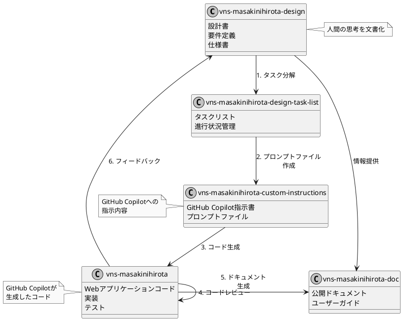

※vns-masakinihirotaアプリはこのファイルから初めます。

---

このリポジトリの使い方

開発に必要なリポジトリを揃えます。

## プロジェクト全体のリポジトリ

- **コードリポジトリ:** Webアプリのリポジトリを用意します。
- **指示書リポジトリ:** GitHub Copilotの指示書リポジトリを用意します。
- **設計書リポジトリ:** 設計書を管理するリポジトリを用意します。
- **タスクリストリポジトリ:** タスクリストを管理するリポジトリを用意します。
- **ドキュメントリポジトリ:** ドキュメントを管理するリポジトリを用意します。
- **サンプルリポジトリ:** サンプルコードを管理するリポジトリを用意します。

このリポジトリはドキュメントのリポジトリです。


---

# このWorkspaceでいちばん重要なルール

このWorkspaceでは、vns-masakinihirota-docリポジトリに書かれていることが最優先されます。

2番目が vns-masakinihirota-custom-instructionsリポジトリに書かれていることです。

3番目が vns-masakinihirota-designリポジトリに書かれていることです。

4番目が vns-masakinihirota-design-task-listリポジトリに書かれていることです。


# Documentationのフレームワーク

vitepressを使ってDocumentationを作成します。

# GitHub Copilotを使うためのルール

## 「#記号」
#記号をつけると、ファイル名を指定できます。これにより、GitHub Copilot Chatに特定のファイルをコンテキストとして参照させることができます。

例えば:
- `#BasketService.cs` とすると、BasketService.csファイルの内容をCopilotに参照させられます
- `#MyFile.cs: 66-72` とすると、MyFile.csファイルの66〜72行目を参照できます

また、#記号はファイル名だけでなく、次のような要素も参照できます:
- メソッド名：`#AddItemToBasket`（特定のメソッドを参照）
- クラス名：`#BasketService`（特定のクラスを参照）
- 関数名：`#CalculateTotal`（特定の関数を参照）

これは「チャット変数」と呼ばれる機能の一部です。その他のチャット変数として以下のものがあります:
- `#block`：現在のコードブロックを参照
- `#class`：現在のクラスを参照
- `#function`：現在の関数またはメソッドを参照
- `#selection`：選択中のテキストを参照
- `#file`：現在のファイルの内容を参照
- `#line`：現在のコード行を参照
- `#path`：ファイルパスを参照
- `#project`：プロジェクトのコンテキストを参照
[GitHub Docs](https://docs.github.com/ja/copilot/using-github-copilot/copilot-chat/github-copilot-chat-cheat-sheet)

## 「@記号」
@記号をつけると、特定の「チャット参加者」を指定できます。チャット参加者は、特定の専門知識を持つドメイン専門家のような役割を果たし、その分野に特化した支援を提供します。

主なチャット参加者には以下のものがあります:
- `@workspace`：ワークスペース（プロジェクト全体）のコードに関するコンテキストを持ち、プロジェクト構造や設計パターンの質問に適しています
- `@github`：GitHub固有のCopilotスキルを活用できます
- `@terminal`：ターミナルコマンドの作成やデバッグに関するヘルプを提供します
- `@vscode`：Visual Studio Codeコマンドと機能に関するコンテキストを持ちます
- `@azure`：Azureサービスに関するコンテキストを持ちます（プレビュー機能）
[GitHub Docs](https://docs.github.com/ja/copilot/using-github-copilot/copilot-chat/github-copilot-chat-cheat-sheet)

## その他の便利な機能

### スラッシュコマンド
`/`をつけると、特定のコマンドを実行できます。例えば:
- `/explain`：コードの説明を取得
- `/fix`：選択したコードの問題を修正
- `/tests`：単体テストを生成
- `/doc`：ドキュメントコメントを追加
- `/optimize`：コードのパフォーマンスを最適化
[GitHub Docs](https://docs.github.com/ja/copilot/using-github-copilot/copilot-chat/github-copilot-chat-cheat-sheet)

### 使用例
- `#MyFile.cs: 66-72の目的は何ですか?`（特定のファイルの特定行を参照）
- `@workspace内に削除機能はありますか?`（ワークスペース全体を検索）
- `#BasketService.csのテストはどこにありますか?`（特定のファイルに関連するテストを探す）
- `/explain #AddItemToBasket`（特定のメソッドの説明を取得）

これらの機能を使いこなすことで、GitHub Copilotとより効率的にコミュニケーションを取り、開発作業を効率化することができます。


---


# 全体像

## 全リポジトリ

コードを書く場所: vns-masakinihirotaリポジトリ
指示書を書く場所: vns-masakinihirota-custom-instructionsリポジトリ
設計書を書く場所: vns-masakinihirota-designリポジトリ
タスクリストを書く場所: vns-masakinihirota-design-task-listリポジトリ
ドキュメントを書く場所: vns-masakinihirota-docリポジトリ
サンプルを書く場所: vns-masakinihirota-sampleリポジトリ

複数のリポジトリを用意して、VSCodeのワークスペース機能を使って、1つのWebアプリ開発プロジェクトとします。
以下プロジェクトと呼びます。

このREADME.mdファイルについて
* このプロジェクト全体のREADME.mdファイル
* ドキュメントのREADME.mdファイル
を兼ねています。

# プロジェクト全体のREADME.md

※このプロジェクトの開始場所
プロジェクト名 masakinihirota

# masakinihirotaプロジェクト全体のルール

ルール1 ※最優先ルール
ドキュメントにかかれていることが最優先されます。
`vns-masakinihirota-doc`リポジトリの`README.md`に書かれていることが最優先されます。

## リポジトリ関連図



この図は各リポジトリ間の関係と情報の流れを示しています。設計書から始まり、タスク分解、プロンプトファイル作成、コード生成という流れと、フィードバックループやドキュメント生成の関係を表現しています。

# 全リポジトリの管理

VSCodeのワークスペース機能を使って複数のリポジトリをまとめて管理します。

※GitHub Copilotはワークスペース内のファイルを見ています。

## ワークスペースの設定

VSCodeを開き、それぞれのリポジトリを登録します。

## 複数リポジトリをVSCodeのワークスペースで利用する方法

### ワークスペースの作成手順
1. **VS Codeを起動**し、「ファイル」→「ワークスペースをフォルダーに追加...」を選択。
2. 指示書リポジトリとコードリポジトリを追加。
3. 「ワークスペースを名前を付けて保存...」でワークスペースファイルを保存（例: `my-project.code-workspace`）。
4. ワークスペースを開き、GitHub Copilotに指示書を読ませてコード生成を指示。

👇ワークスペース設定のファイルに登録できています。

```[ワークスペース名].code-workspace
{
	"folders": [
		{
			"path": "リポジトリ名1"
		},
		{
			"path": "リポジトリ名2"
		}
	],
	"settings": {
		// ワークスペース専用の設定を書けます。
	}
}

```

ワークスペースの設定ファイルを
ワークスペースに登録したリポジトリのルートに置きます。

作成されたワークスペースファイルは、リポジトリのルートに保存されます。
`_vns-masakinihirota.code-workspace`

----------------------------------------

# ドキュメントのREADME.md

# 用語集

- **コードリポジトリ**: Webアプリのコードを管理するリポジトリ。
- **指示書リポジトリ**: GitHub Copilotの指示書を管理するリポジトリ。
- **設計書リポジトリ**: プロジェクトの設計文書を管理するリポジトリ。
- **タスクリストリポジトリ**: タスクの進捗や管理を行うリポジトリ。
- **ドキュメントリポジトリ**: プロジェクトのドキュメントを管理するリポジトリ。
- **サンプルリポジトリ**: サンプルコードや参考資料を管理するリポジトリ。
- **Supabase**: 認証やデータベースを提供するバックエンドサービス。
- **Drizzle ORM**: 型安全なPostgresデータベース操作のためのORM。
- **Stripe**: 支払い処理とサブスクリプション管理のためのサービス。
- **Tailwind CSS**: ユーティリティファーストのCSSフレームワーク。
- **Vercel**: Next.jsアプリのデプロイプラットフォーム。


