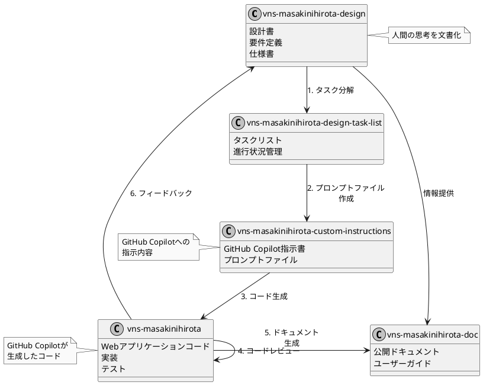

※vns-masakinihirotaアプリはこのファイルから初めます。

---

このリポジトリの使い方

開発に必要なリポジトリを揃えます。

## プロジェクト全体のリポジトリ

- **コードリポジトリ:** Webアプリのリポジトリを用意します。
- **指示書リポジトリ:** GitHub Copilotの指示書リポジトリを用意します。
- **設計書リポジトリ:** 設計書を管理するリポジトリを用意します。
- **タスクリストリポジトリ:** タスクリストを管理するリポジトリを用意します。
- **ドキュメントリポジトリ:** ドキュメントを管理するリポジトリを用意します。
- **サンプルリポジトリ:** サンプルコードを管理するリポジトリを用意します。

このリポジトリはドキュメントのリポジトリです。


---

# 全体像

## 全リポジトリ

コードを書く場所: vns-masakinihirotaリポジトリ
指示書を書く場所: vns-masakinihirota-custom-instructionsリポジトリ
設計書を書く場所: vns-masakinihirota-designリポジトリ
タスクリストを書く場所: vns-masakinihirota-design-task-listリポジトリ
ドキュメントを書く場所: vns-masakinihirota-docリポジトリ
サンプルを書く場所: vns-masakinihirota-sampleリポジトリ

複数のリポジトリを用意して、VSCodeのワークスペース機能を使って、1つのWebアプリ開発プロジェクトとします。
以下プロジェクトと呼びます。

このREADME.mdファイルについて
* このプロジェクト全体のREADME.mdファイル
* ドキュメントのREADME.mdファイル
を兼ねています。

# プロジェクト全体のREADME.md

※このプロジェクトの開始場所
プロジェクト名 masakinihirota

# masakinihirotaプロジェクト全体のルール

ルール1 ※最優先ルール
ドキュメントにかかれていることが最優先されます。
`vns-masakinihirota-doc`リポジトリの`README.md`に書かれていることが最優先されます。

## リポジトリ関連図



この図は各リポジトリ間の関係と情報の流れを示しています。設計書から始まり、タスク分解、プロンプトファイル作成、コード生成という流れと、フィードバックループやドキュメント生成の関係を表現しています。

# 全リポジトリの管理

VSCodeのワークスペース機能を使って複数のリポジトリをまとめて管理します。

※GitHub Copilotはワークスペース内のファイルを見ています。

## ワークスペースの設定

VSCodeを開き、それぞれのリポジトリを登録します。

## 複数リポジトリをVSCodeのワークスペースで利用する方法

### ワークスペースの作成手順
1. **VS Codeを起動**し、「ファイル」→「ワークスペースをフォルダーに追加...」を選択。
2. 指示書リポジトリとコードリポジトリを追加。
3. 「ワークスペースを名前を付けて保存...」でワークスペースファイルを保存（例: `my-project.code-workspace`）。
4. ワークスペースを開き、GitHub Copilotに指示書を読ませてコード生成を指示。

👇ワークスペース設定のファイルに登録できています。

```[ワークスペース名].code-workspace
{
	"folders": [
		{
			"path": "リポジトリ名1"
		},
		{
			"path": "リポジトリ名2"
		}
	],
	"settings": {
		// ワークスペース専用の設定を書けます。
	}
}

```

ワークスペースの設定ファイルを
ワークスペースに登録したリポジトリのルートに置きます。

作成されたワークスペースファイルは、リポジトリのルートに保存されます。
`_vns-masakinihirota.code-workspace`

----------------------------------------

# ドキュメントのREADME.md

# 用語集

- **コードリポジトリ**: Webアプリのコードを管理するリポジトリ。
- **指示書リポジトリ**: GitHub Copilotの指示書を管理するリポジトリ。
- **設計書リポジトリ**: プロジェクトの設計文書を管理するリポジトリ。
- **タスクリストリポジトリ**: タスクの進捗や管理を行うリポジトリ。
- **ドキュメントリポジトリ**: プロジェクトのドキュメントを管理するリポジトリ。
- **サンプルリポジトリ**: サンプルコードや参考資料を管理するリポジトリ。
- **Supabase**: 認証やデータベースを提供するバックエンドサービス。
- **Drizzle ORM**: 型安全なPostgresデータベース操作のためのORM。
- **Stripe**: 支払い処理とサブスクリプション管理のためのサービス。
- **Tailwind CSS**: ユーティリティファーストのCSSフレームワーク。
- **Vercel**: Next.jsアプリのデプロイプラットフォーム。


