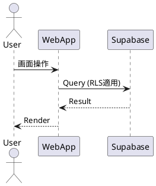

# vns-masakinihirota ドキュメント

本リポジトリはアプリケーションの正式ドキュメント集です。
設計書・要件定義は別リポジトリ `vns-masakinihirota-design` を参照。
実装は `vns-masakinihirota`。

## ドキュメント分類
| ディレクトリ | 内容 |
|--------------|------|
| specs/ | 機能仕様（Feature Spec） |
| adr/ | Architecture Decision Record |
| components/ | コンポーネント仕様 |
| actions/ | Server Action / API 仕様 |
| db/ | スキーマ・RLS・マイグレーション差分 |
| tests/ | テスト計画・ケース |
| release/ | リリースノート候補 |
| index/ | 自動生成インデックス (AI管理) |

## 運用フロー (簡略)
1. タスク着手前: design リポジトリ確認 + Serena MCP メタ更新
2. 実装差分 → プロンプト `ドキュメント管理.prompt.md` に入力
3. 種別判定→必要文書生成/更新
4. インデックス再生成 (auto-doc-index)
5. Conventional Commits (50字以内日本語) でコミット

## 命名規約（抜粋）
- 機能仕様: `spec-<domain>-<feature>.md`
- ADR: `ADR-<連番>-<短縮英語>.md`
- DB差分: `schema-diff-YYYYMMDD-<topic>.md`

## PlantUML 例（占位）

## 技術スタック概要
- Next.js (App Router / Server Components / Server Actions)
- TypeScript / Zod / Conform
- Supabase + Drizzle ORM (RLS, 型生成)
- Tailwind + Radix UI + Shadcn/UI
- Zustand 状態管理
- Vitest / React Testing Library / Playwright
- Stripe (決済予定), Sentry (監視)

## セキュリティ / RLS 要点
- 行レベル制御: 認証ユーザー単位アクセス
- 入力: Zod + Conform 事前バリデーション
- 秘密情報: env (.env.local, ビルド未同梱)

## ドキュメント自動化
AI プロンプト: `.github/prompts/ドキュメント管理.prompt.md`
mode: incremental / full-audit / index-update / verify

## 未決 / 今後
- パフォーマンス計測指標具体化
- 多言語化方針
- Stripe 決済フロー詳細 ADR 化

