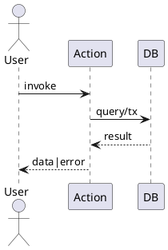

# action-<scope>-<name> (テンプレ)

## 概要
<目的一行>

## 入力スキーマ (Zod)
```ts
// import { z } from "zod";
// export const Input = z.object({ ... });
```

## 出力スキーマ
```ts
// export const Output = z.object({ ... });
```

## コントラクト
- 事前条件: …
- 事後条件: …
- 不変条件: …

## 認証 / 認可 / RLS
- 要ログイン / 所有者一致 等

## エラーマップ
| コード | 説明 | ユーザー提示 |
|--------|------|--------------|

## フロー


## 使用例
```ts
// const res = await actionName(formData);
```

## テスト観点
- 正常
- バリデーション失敗
- RLS 拒否
- 競合 (同時更新)

## 未決
- 追加ログ要件
