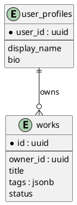

# スキーマ概要 (初期)

## テーブル (初期想定)
| テーブル | 用途 | 主キー | 主要カラム |
|----------|------|--------|------------|
| user_profiles | プロフィール | user_id | display_name, bio |
| works | 作品 | id | owner_id, title, tags(jsonb), status |

## インデックス (予定)
| テーブル | カラム | 種別 | 目的 |
|----------|--------|------|------|
| works | owner_id | btree | 所有者絞込 |
| works | tags GIN | gin | タグ検索 |

## RLS ポリシー方針
| テーブル | ポリシー | 条件 |
|----------|----------|------|
| user_profiles | select/update 自己 | auth.uid() = user_id |
| works | select 所有 or 公開 | owner_id = auth.uid() OR status='public' |
| works | insert/update/delete 所有 | owner_id = auth.uid() |

## マイグレーション運用
- Drizzle で declarative 定義
- 破壊的変更 → ADR 必須
- 差分文書: `db/schema-diff-YYYYMMDD-<topic>.md`

## 型生成
- drizzle-kit + Supabase 型生成を比較
- 公式型との不整合は lint

## ER 図 (占位)

## リスク
- tags GIN コスト
- works 増加時 status フィルタ + pagination 戦略未確定

## 未決
- Soft delete 導入要否
- works.status enum 候補 (draft/public/archived?)

