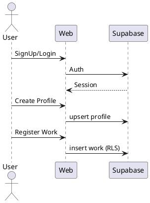

# Core Platform (MVP 基盤) 機能仕様

## 概要
認証・ユーザープロフィール・作品登録土台を提供する初期コア。

## 背景 / 目的
早期にコアエンティティと RLS ポリシーを確立し後続機能拡張を容易化。

## ユーザーストーリー
- 利用者として、アカウントを作成し作品を登録したい。
- クリエイターとして、他者と安全にコラボ情報を共有したい。

## スコープ
- Email/Password 認証 (Supabase Auth)
- プロフィール CRUD
- 作品メタ登録 (タイトル / タグ / ステータス)

## 非スコープ
- 決済
- 通知
- 多言語化

## フロー (概要)

## エンティティ (抜粋)
| 名称 | 主キー | 主属性 |
|------|--------|--------|
| user_profiles | user_id (uuid) | display_name, bio |
| works | id (uuid) | owner_id, title, tags(jsonb), status |

## 状態 / イベント
| イベント | 条件 | 結果 |
|----------|------|------|
| PROFILE_CREATED | 新規ユーザー初回保存 | user_profiles 行 |
| WORK_CREATED | タイトル必須 | works 行 |

## バリデーション要件
- display_name: 1..50
- title: 1..120
- tags: 配列長 <= 15, 各長 <= 24

## エラーハンドリング
| ケース | レスポンス方針 |
|--------|----------------|
| 権限不足 (RLS) | 403 + ガイドリンク |
| Validation Fail | 422 + フィールド別メッセージ |

## 非機能
| 項目 | 初期目標 |
|------|----------|
| 応答 | P95 < 400ms (主要 CRUD) |
| 可用性 | Supabase 標準 SLA |
| セキュリティ | RLS 100% カバレッジ |
| アクセシビリティ | WCAG 2.1 AA 対応方針 |

## テスト観点
- Auth signup/login 正常/失敗
- RLS: 他ユーザー作品編集不能
- Tag 境界: 15 個 / 16 個
- XSS 入力除去

## リスク
- タグ検索用インデックス未調整
- 作品数膨張時のクエリ計画未検証

## 未決事項
- タグ正規化テーブル導入要否
- works.status の enum 固定一覧

